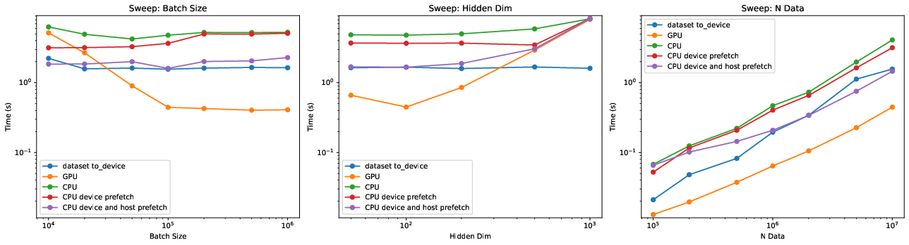

# 🚀 Dataloading for AMPC Training in Jax 🚀

This repo contains example implementations for dataloading of "small" datasets of dynamical systems in Jax.
We compare the performance of pure CPU dataloading, CPU dataloading with device prefetch (prefetching a few batches to GPU in advance), CPU dataloading with device prefetch and host prefetch (additionally prefetching multiple batches on the host using a Python thread pool), and pure GPU dataloading (dataset is transferred to GPU once and kept on GPU).
The comparison is tailored to dynamical system data (datasets containing states `X`, action sequences `U`, and references `Y`).

**TL;DR**: ⏱️ In terms of "GPU wallclock hours" (the unit of billing on many HPC and cloud computing providers), it is most effective to load the complete dataset to GPU for small models.

## 💻 Running the evaluation 💻

To sweep across different batch, model, and dataset sizes, run:
```
python main.py
```

📊 **Result:** 📊

|  |
|:-------------------------------------------------------------------------------------:|
| **Figure 1: Performance evaluations of dataloaders on NVIDIA A100 GPU with sweeps over batch size, model size, and dataset size. For comparison, the time for putting the complete dataset on the device is also plotted (only done once when initializing the GPU dataloader).** |